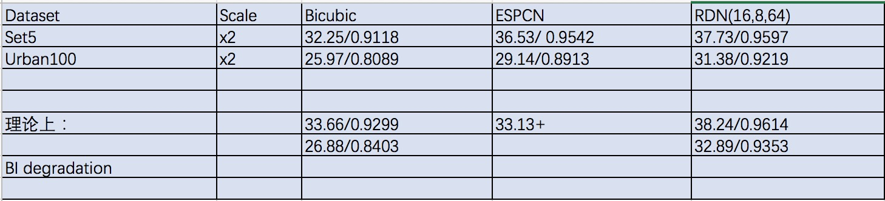

# 介绍
这是这篇cvpr18的文章[《Residual Dense Network for Image Super-Resolution》](https://arxiv.org/abs/1802.08797)的keras+tensorflow实现。
# 结果
Set5数据集的结果

# 使用
打开inference.py，里面有xdir改一下，数据集去这里[下载](https://github.com/yulunzhang/RDN)。
# 测试
想测试PSNR指标，用Matlab更准确，仍然这里[下载](https://github.com/yulunzhang/RDN)。

***

# introduction
this is the implementation of this cvpr18 article[《Residual Dense Network for Image Super-Resolution》](https://arxiv.org/abs/1802.08797) with keras as well as tensorflow.

# result
the result in Set5 dataset

# usage
open inference.py,modify xdir='?',this is a link of [dataset](https://github.com/yulunzhang/RDN)

# test
attain the metric of PSNR,researcher prefer to use Matlab.Still clone at [here](https://github.com/yulunzhang/RDN)